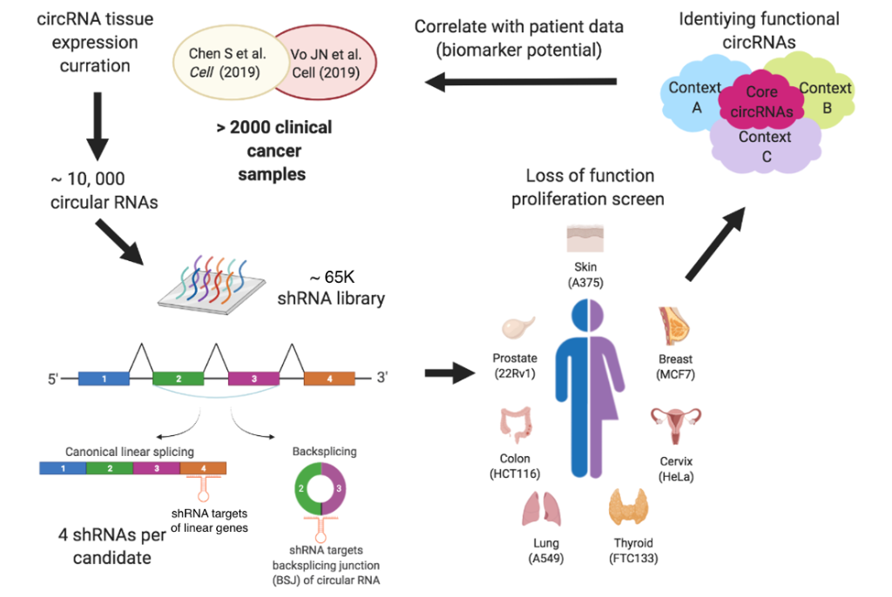

# FunCirc - Functional Circular RNA Database

A web application for querying circRNA essentiality and clinical expression data from multiple studies. 

<!-- This is a **React + Node.js** rebuild of the original [R Shiny FunCirc application](https://github.com/HansenHeLab/FunCirc/tree/main). -->

<!-- -->


## Overview

FunCirc integrates data from multiple circRNA screening studies and clinical datasets, enabling researchers to:

- **Query circRNA Essentiality**: Visualize MAGeCK screen results showing which circRNAs are essential for cell viability across different cancer cell lines
- **Query Clinical Expression**: Explore circRNA expression patterns across patient cohorts and cancer types

## Technology Stack

| Layer | Technology |
|-------|------------|
| **Frontend** | React 18, TypeScript, Vite |
| **State Management** | Zustand |
| **Data Fetching** | TanStack Query (React Query) |
| **Visualizations** | Recharts, D3.js, Custom SVG |
| **Backend** | Node.js, Express, TypeScript |
| **Data Format** | JSON (converted from R RDS files) |

## Project Structure

```
db_react/
├── client/                 # React frontend
│   ├── src/
│   │   ├── components/     # Reusable UI components
│   │   ├── pages/          # Page components (Home, Essentiality, Clinical)
│   │   ├── hooks/          # Custom React hooks
│   │   ├── store/          # Zustand state management
│   │   └── App.tsx         # Main application component
│   ├── public/             # Static assets (images)
│   ├── index.html
│   ├── vite.config.ts
│   └── package.json
│
├── server/                 # Express backend
│   ├── src/
│   │   ├── routes/         # API endpoints
│   │   │   ├── studies.ts  # Essentiality data endpoints
│   │   │   ├── clinical.ts # Clinical expression endpoints
│   │   │   └── search.ts   # Gene search endpoint
│   │   ├── types.ts        # TypeScript type definitions
│   │   └── index.ts        # Server entry point
│   ├── data/               # JSON data files (see Data Setup)
│   └── package.json
│
├── scripts/                # Data conversion utilities
│   └── convert_data.js     # Convert R RDS to JSON
│
├── data/                   # Shared data directory
└── package.json            # Root package.json
```

## Installation

### Prerequisites

- **Node.js** v18 or higher
- **npm** v9 or higher

### Setup

1. **Clone the repository**
   ```bash
   git clone https://github.com/HansenHeLab/FunCirc-React.git
   cd FunCirc-React
   ```

2. **Install dependencies**
   ```bash
   # Install root dependencies (optional, for workspace management)
   npm install
   
   # Install client dependencies
   cd client
   npm install
   cd ..
   
   # Install server dependencies
   cd server
   npm install
   cd ..
   ```

3. **Set up data files**
   
   The application requires JSON data files in `server/data/`. These should be converted from the original R RDS files using the scripts in `scripts/`.
   
   Expected data structure:
   ```
   server/data/
   ├── her-et-al/
   │   ├── annotations.json
   │   ├── screen_data.json
   │   └── genes.json
   ├── chen-et-al/
   │   ├── annotations.json
   │   ├── circ_data.json
   │   ├── genes.json
   │   └── linear_data.json
   ├── liu-et-al/
   │   ├── ht29/
   │   ├── 293ft/
   │   └── hela/
   ├── li-et-al/
   │   ├── colon/
   │   ├── pancreas/
   │   ├── brain/
   │   └── skin/
   └── clinical/
       ├── split/
       ├── arul-et-al.json
       ├── cpcg.json
       └── breast-cohort.json
   ├── gene-search-index.json
   ```

## Running the Application

### Development Mode

Open **two terminal windows**:

**Terminal 1 - Start the backend server:**
```bash
cd server
npm run dev
```
Server will run on `http://localhost:3001`

**Terminal 2 - Start the frontend:**
```bash
cd client
npm run dev
```
Frontend will run on `http://localhost:5173`

### Production Build

```bash
# Build client
cd client
npm run build

# Build server
cd ../server
npm run build
```

## API Endpoints

| Endpoint | Description |
|----------|-------------|
| `GET /api/studies` | List all available studies |
| `GET /api/studies/:id/genes` | Get genes for a study |
| `GET /api/studies/:id/annotations` | Get circRNA annotations |
| `GET /api/studies/:id/essentiality` | Get essentiality dotmap data |
| `GET /api/clinical/datasets` | List clinical datasets |
| `GET /api/clinical/:id/expression` | Get clinical expression data |
| `GET /api/search?q=...` | Search genes across studies |

## Data Sources

### Screening Studies
- **Her et al.** – shRNA genome-wide circRNA screen (7 cancer cell lines)
- **Liu et al.** – shRNA-based circRNA screen (18 cell lines, 4 tissue types)
- **Li et al.** – CRISPR-RfxCas13d circRNA screen (Colon, Pancreas, Brain, Skin)
- **Chen et al.** – shRNA circRNA screen in prostate cancer (LNCaP, V16A, 22Rv1, PC-3)

### Clinical Datasets
- **Arul et al. (Vo et al.)** – The landscape of circular RNA in cancer
- **CPCG (Fraser et al.)** – Canadian Prostate Cancer Genome Network
- **In-house Breast Cohort** – Breast cancer subtypes

## Deployment

For deployment to Google Cloud Platform, see the [DEPLOYMENT.md](DEPLOYMENT.md) guide.

### Quick Deploy to Cloud Run

```bash
# Build Docker image
docker build -t funcirc-app .

# Push to Artifact Registry
docker tag funcirc-app us-central1-docker.pkg.dev/[PROJECT-ID]/funcirc/app:v1
docker push us-central1-docker.pkg.dev/[PROJECT-ID]/funcirc/app:v1

# Deploy to Cloud Run
gcloud run deploy funcirc \
    --image us-central1-docker.pkg.dev/[PROJECT-ID]/funcirc/app:v1 \
    --memory 4Gi \
    --allow-unauthenticated
```

## Files to Include in GitHub

Upload these files/folders (the `.gitignore` will exclude `node_modules/` and build artifacts):

```
✅ client/           (entire folder)
✅ server/           (entire folder, including server/data/ with JSON files)
✅ scripts/          (data conversion utilities)
✅ .gitignore
✅ package.json
✅ README.md
✅ Dockerfile        (if deploying to cloud)

❌ node_modules/     (excluded by .gitignore)
❌ dist/             (excluded by .gitignore)
```

> **Note**: The `server/data/` folder contains large JSON files. Consider using [Git LFS](https://git-lfs.github.com/) for files over 100MB, or host data externally.

## License

This project is for research purposes. Please cite the original studies when using this database.

## Contact

[He Lab @ UHN](https://www.hansenhelab.org/)
